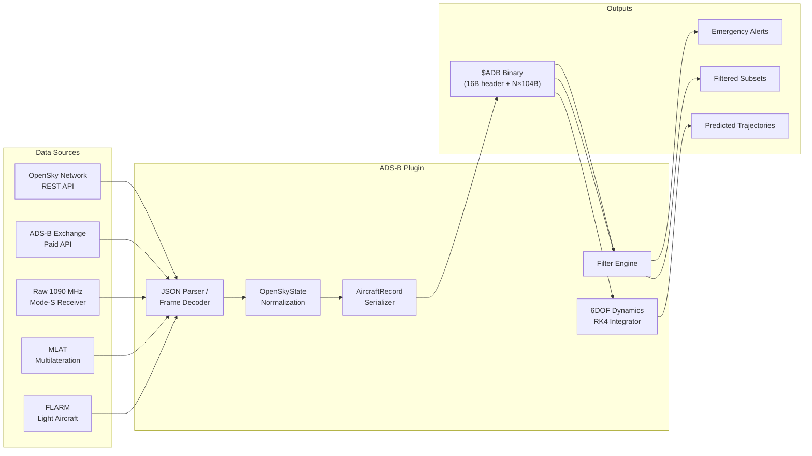
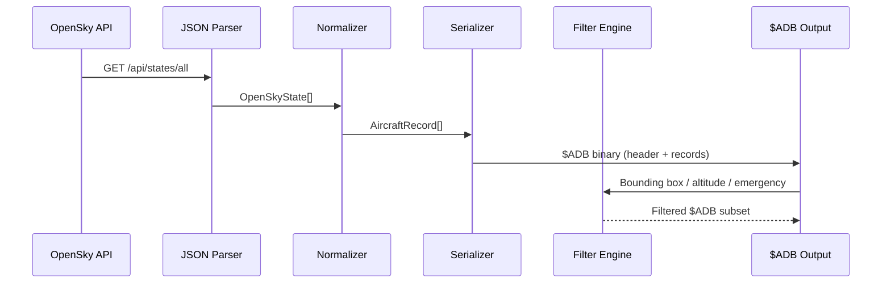
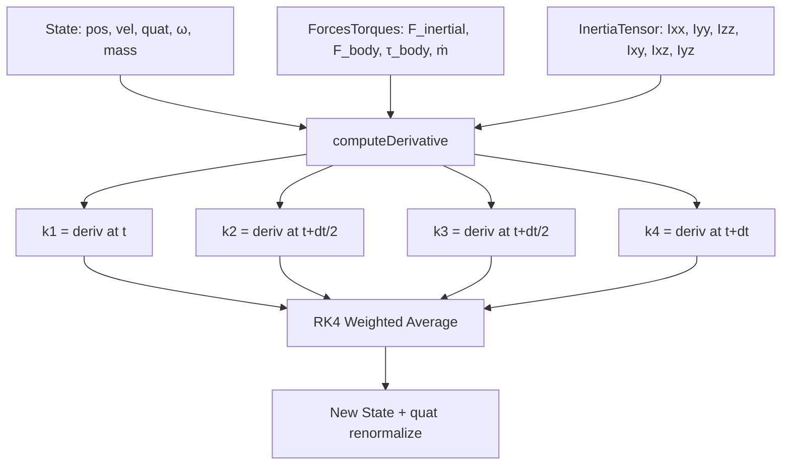

# 🛩️ ADS-B Aircraft Tracking Plugin

[](https://github.com/the-lobsternaut/adsb-sdn-plugin/actions)
[](LICENSE)
[](https://en.cppreference.com/w/cpp/17)
[](https://github.com/the-lobsternaut)

**Real-time aircraft surveillance via ADS-B, Mode-S, and OpenSky Network data — with 6DOF rigid body dynamics for high-fidelity flight modeling.**

---

## Overview

The ADS-B plugin ingests live aircraft state vectors from multiple sources (OpenSky Network REST API, ADS-B Exchange, raw 1090 MHz Mode-S messages, MLAT, and FLARM), normalizes them into a compact binary wire format (`$ADB`), and provides filtering/detection capabilities including:

- **Emergency detection** — squawk 7700 (emergency), 7500 (hijack), 7600 (comms failure), 7777 (military intercept)
- **UAV identification** — aircraft category classification per DO-260B/DO-242A
- **High-performance aircraft detection** — altitude/speed profiling for military or unusual flight patterns
- **Geographic & altitude filtering** — bounding box and altitude band queries
- **6DOF dynamics** — full rigid-body simulation with RK4 integration for trajectory prediction and flight reconstruction

### Why It Matters

ADS-B data is the backbone of modern air traffic awareness. By fusing data from multiple sources into a unified binary format, this plugin enables downstream SDN consumers to build real-time airspace pictures, detect anomalies, correlate with satellite observations, and feed link analysis graphs — all without dealing with heterogeneous API formats.

---

## Architecture



### Data Flow Pipeline



---

## Data Sources & APIs

| Source | URL | Type | Auth |
|--------|-----|------|------|
| **OpenSky Network** | [opensky-network.org/api/states/all](https://opensky-network.org/api/states/all) | REST | OAuth2 (optional, free tier) |
| **ADS-B Exchange** | [adsbexchange.com/data](https://www.adsbexchange.com/data/) | REST | API key (paid) |
| **Raw 1090 MHz** | Local SDR receiver (dump1090, readsb) | UDP/TCP | None (local) |
| **MLAT** | Multilateration services (adsbhub.org) | TCP feed | Registration |
| **FLARM** | [flarm.com](https://flarm.com/) | Serial/UDP | Hardware |

---

## Research & References

- **RTCA DO-260B** — *Minimum Operational Performance Standards for 1090 MHz Extended Squitter ADS-B and TIS-B*. The definitive standard for ADS-B message formats, aircraft categories, and transponder requirements.
- **ICAO Annex 10, Vol. IV** — *Surveillance and Collision Avoidance Systems*. Defines Mode-S transponder protocols and interrogation procedures.
- **ICAO Doc 9871** — *Technical Provisions for Mode S Services and Extended Squitter*. Specification for Mode-S data link protocols.
- Schäfer, M. et al. (2014). ["Bringing Up OpenSky: A Large-scale ADS-B Sensor Network for Research"](https://opensky-network.org/community/publications). *IPSN '14*. Describes the OpenSky Network architecture and data model.
- Strohmeier, M. et al. (2015). ["On the Security of the Automatic Dependent Surveillance-Broadcast Protocol"](https://ieeexplore.ieee.org/document/7001879). *IEEE Communications Surveys & Tutorials*. Comprehensive security analysis of ADS-B.
- **EUROCONTROL** — [ADS-B Surveillance System](https://www.eurocontrol.int/ads-b). European ADS-B deployment and standards.
- **FAA ADS-B** — [faa.gov/air_traffic/technology/adsb](https://www.faa.gov/air_traffic/technology/adsb). U.S. ADS-B mandate and technical overview.

---

## Technical Details

### Wire Format: `$ADB`

The plugin outputs a compact packed binary format optimized for network transmission:

```
┌──────────────────────────────────────────────┐
│ ADBHeader (16 bytes)                         │
│  magic[4]   = "$ADB"                         │
│  version    = uint32 (currently 1)           │
│  source     = uint32 (DataSource enum)       │
│  count      = uint32 (number of records)     │
├──────────────────────────────────────────────┤
│ AircraftRecord[0] (104 bytes)                │
│  icao24[8], callsign[8], country[24]         │
│  epoch_s, pos_epoch_s (double×2)             │
│  lat_deg, lon_deg (double×2)                 │
│  baro_alt_m, geo_alt_m (float×2)            │
│  ground_speed_ms, track_deg, vert_rate       │
│  on_ground, spi, category, pos_source        │
│  squawk[5], squawk_alert, reserved[2]        │
├──────────────────────────────────────────────┤
│ AircraftRecord[1] ...                        │
│ ...                                          │
│ AircraftRecord[N-1]                          │
└──────────────────────────────────────────────┘
```

**Total size**: `16 + N × 104` bytes

### Aircraft Categories (DO-260B)

| Code | Category | Description |
|------|----------|-------------|
| 0 | Unknown | No category info |
| 2 | Light | < 15,500 lbs |
| 3 | Small | 15,500–75,000 lbs |
| 4 | Large | 75,000–300,000 lbs |
| 5 | High Vortex | e.g., B757 |
| 6 | Heavy | > 300,000 lbs |
| 7 | High Perf | > 5g, > 400 kts |
| 8 | Rotorcraft | Helicopters |
| 14 | UAV | Unmanned aerial vehicle |
| 15 | Space Vehicle | Reentry vehicles |

### Emergency Squawk Detection

| Squawk | Alert | Meaning |
|--------|-------|---------|
| 7700 | EMERGENCY | General emergency |
| 7500 | HIJACK | Unlawful interference |
| 7600 | COMMS_FAIL | Radio failure |
| 7777 | MIL_INTERCEPT | Military intercept |

### 6DOF Rigid Body Dynamics

The plugin includes a full 6DOF dynamics engine (`sixdof_core.h`) for trajectory reconstruction and prediction:

- **State vector**: 13 elements — position (3), velocity (3), quaternion (4), angular velocity (3) + scalar mass
- **Quaternion convention**: Hamilton, scalar-first `[w, x, y, z]`
- **Integration**: Classical RK4 with quaternion renormalization at each step
- **Euler's equations**: `I·ω̇ = τ - ω × (I·ω)` for rotational dynamics
- **Aerodynamic moments**: Full Cm/Cn/Cl coefficient model with α, β, and angular rate terms
- **Inertia tensor**: Symmetric 6-value representation with mass-scaling for variable-mass systems



---

## Input/Output Format

### Input

| Format | Source | Description |
|--------|--------|-------------|
| `application/json` | OpenSky API | JSON array of state vectors |
| `application/json` | ADS-B Exchange | Aircraft state JSON |
| Raw Mode-S frames | 1090 MHz SDR | Binary Mode-S/ADS-B messages |

**OpenSky JSON structure** (per aircraft):
```json
{
  "icao24": "3c6444",
  "callsign": "DLH123",
  "origin_country": "Germany",
  "time_position": 1710499995,
  "last_contact": 1710500000,
  "longitude": 8.7,
  "latitude": 50.1,
  "baro_altitude": 11000,
  "on_ground": false,
  "velocity": 250,
  "true_track": 90,
  "vertical_rate": 0,
  "geo_altitude": 11050,
  "squawk": "1000",
  "spi": false,
  "position_source": 0,
  "category": 4
}
```

### Output

| Format | ID | Description |
|--------|-----|-------------|
| `$ADB` | Binary | Packed header (16B) + N × AircraftRecord (104B) |

---

## Build Instructions

```bash
# Clone with submodules
git clone --recursive https://github.com/the-lobsternaut/adsb-sdn-plugin.git
cd adsb-sdn-plugin

# Build native (tests)
mkdir -p build && cd build
cmake ../src/cpp -DCMAKE_CXX_STANDARD=17
make -j$(nproc)
ctest --output-on-failure

# Build WASM (if build.sh present)
./build.sh
```

---

## Usage Examples

### Serialize Aircraft Data

```cpp
#include "adsb/types.h"

// Create records from OpenSky data
adsb::OpenSkyState os;
os.icao24 = "3c6444";
os.callsign = "DLH123";
os.latitude = 50.1;
os.longitude = 8.7;
os.baro_altitude = 11000;
os.velocity = 250;
os.squawk = "7700";

auto record = adsb::openSkyToRecord(os);

// Serialize to $ADB binary
std::vector<adsb::AircraftRecord> records = {record};
auto buffer = adsb::serializeAircraft(records, adsb::DataSource::OPENSKY);
// buffer.size() == 16 + 104 = 120 bytes
```

### Filter for Emergencies

```cpp
auto emergencies = adsb::filterEmergencies(records);
for (const auto& r : emergencies) {
    printf("ALERT: %s squawk=%s type=%d\n", 
           r.callsign, r.squawk, r.squawk_alert);
}
```

### Geographic Bounding Box Query

```cpp
// Western Europe: lat 35-60°N, lon -10-40°E
auto europe = adsb::filterByBBox(records, 35, 60, -10, 40);
```

### Detect High-Performance Aircraft

```cpp
// Aircraft above 12km, faster than 250 m/s
auto highPerf = adsb::detectHighPerf(records, 12000, 250);
```

### 6DOF Flight Simulation

```cpp
#include "adsb/sixdof_core.h"

sixdof::State s;
s.pos = {0, 0, -10000};     // 10km altitude
s.vel = {250, 0, 0};         // 250 m/s forward
s.mass = 75000;               // 75 tonnes
s.quat = sixdof::qfromAxisAngle({1,0,0}, 30.0 * M_PI / 180.0); // 30° bank

sixdof::InertiaTensor I = sixdof::inertiaDiag(2e6, 4e6, 5e6);

auto forceFn = [](const sixdof::State& s, double t) -> sixdof::ForcesTorques {
    sixdof::ForcesTorques ft;
    ft.force_inertial = {0, 0, s.mass * 9.81}; // gravity
    ft.force_body = {50000, 0, 0};               // thrust
    return ft;
};

double dt = 0.01, t = 0;
for (int i = 0; i < 6000; i++) {
    s = sixdof::rk4Step(s, I, dt, t, forceFn);
    t += dt;
}
```

---

## Dependencies

| Dependency | Version | Purpose |
|-----------|---------|---------|
| C++17 compiler | GCC 7+ / Clang 5+ | Core language standard |
| CMake | ≥ 3.14 | Build system |
| Emscripten | Latest | WASM compilation (optional) |

> **Zero external library dependencies.** All types, serialization, filtering, and 6DOF dynamics are implemented in headers with only C++ standard library.

---

## Plugin Manifest

```json
{
  "schemaVersion": 1,
  "name": "adsb-tracker",
  "version": "0.1.0",
  "description": "ADS-B aircraft tracking — consumes OpenSky Network API and raw Mode-S/ADS-B data. Tracks aircraft position, velocity, altitude, callsign, squawk codes. Detects emergency transponder codes (7700/7500/7600), UAVs, high-performance aircraft patterns.",
  "author": "DigitalArsenal",
  "license": "Apache-2.0",
  "inputFormats": ["application/json"],
  "outputFormats": ["$ADB"],
  "dataSources": [
    {
      "name": "OpenSky Network",
      "url": "https://opensky-network.org/api/states/all",
      "type": "REST",
      "auth": "oauth2 (optional, free tier available)"
    }
  ]
}
```

---

## Project Structure

```
adsb/
├── plugin-manifest.json        # Plugin metadata and data source config
├── README.md                   # This file
├── .gitignore
└── src/
    └── cpp/
        ├── CMakeLists.txt      # Build configuration
        ├── include/
        │   └── adsb/
        │       ├── types.h         # Core types, wire format, serialization
        │       └── sixdof_core.h   # 6DOF rigid body dynamics engine
        └── tests/
            ├── test_adsb.cpp       # Wire format & filter tests
            └── test_sixdof.cpp     # 6DOF dynamics integration tests
```

---

## License

Apache-2.0 — see [LICENSE](LICENSE) for details.

---

*Part of the [Space Data Network](https://github.com/the-lobsternaut) plugin ecosystem.*
